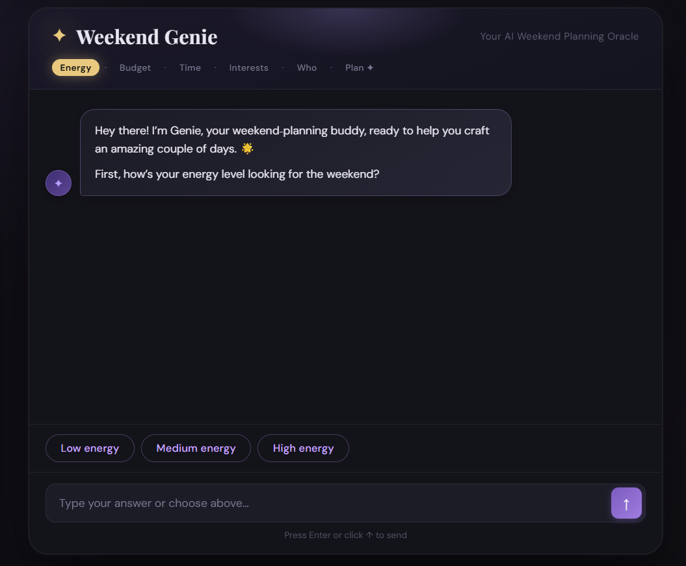

# 🤖 AI Day Planner Website

A Flask-based web application for your AI Day Planner using the Gemini
API.

## 📋 Project Structure

    weekend-planner/
    ├── app.py                 # Flask application
    ├── main.py                # Original CLI version
    ├── requirements.txt       # Python dependencies
    ├── templates/
    │   └── index.html         # Chat interface HTML
    └── static/
        └── style.css          # Styling

## 🚀 Getting Started

### 1. Install Dependencies

``` bash
pip install -r requirements.txt
```

### 2. Run the Flask App

``` bash
python app.py
```

The application will start on `http://localhost:5000`.

### 3. Open in Browser

Navigate to:

    http://localhost:5000

## ✨ Features

-   💬 Real-time chat interface\
-   🎨 Modern, responsive UI\
-   📱 Desktop + mobile support\
-   ⏰ Personalized day planning\
-   🎯 Budget + preference handling\
-   🌅 Morning, afternoon, evening breakdown

## 🎯 How to Use

1.  Start chatting with the planner\
2.  Share mood, budget, preferences\
3.  Receive a structured day plan\
4.  Ask follow‑up questions\
5.  Type **"quit"** to end the chat

## 🎥 Video Demo

Paste your video demo link here:\
**VIDEO_URL_HERE**

## 📸 Screenshots

Add your screenshots by replacing the filenames:

### Screenshot 1



### Screenshot 2


## ⚙️ Configuration

The API key is set in `app.py`.\
To use a different key: 1. Open `app.py` 2. Replace the `api_key` value\
3. Or set the environment variable:

    GEMINI_API_KEY=your_key_here

## 🔧 Troubleshooting

-   **Port in use** → Change port in `app.py`\
-   **API errors** → Verify your Gemini API key\
-   **Network errors** → Check your internet

## 📝 Notes

-   CLI version in `main.py`\
-   Each session has independent chat history\
-   History resets on reload

------------------------------------------------------------------------

Enjoy your personalized day planning with AI! 🌟
